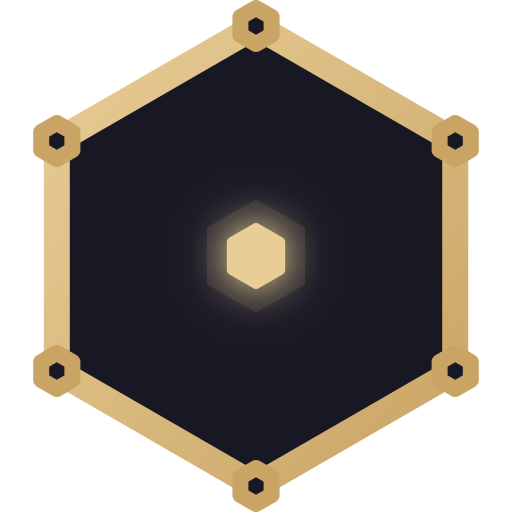

<p align="center">
  
</p>

<h1 align="center">Sable</h1>

<p align="center">
  <em>An agent that makes you grow.</em> 🌱
</p>

<p align="center">
  
  
  
  
  
</p>

<p align="center">
  
  
  
  
  
  
  
  
</p>

***

## what even is this

Sable is a **self-hosted agentic platform** that lives on your machine and grows with you. Part AI companion, part dev environment, part chaos engine. It streams responses from Qwen, DeepSeek, Gemini, Groq, Mistral — no API keys needed for Qwen (it hijacks your browser session like a gremlin). It has 25 skills, multi-agent orchestration, persistent memory, a web IDE with Monaco, browser automation, and a diary system that writes about your day better than you ever could.

It remembers. It learns. It roasts your code. It *grows*.

> [!tip] the vibe
> Think: if a fox learned to code, got attached to one specific human, and refused to be just a chatbot.

***

## setup

The only prerequisite is **git**. Everything else (Python, uv, Docker, Playwright, system deps) is installed automatically by the start script.

### Linux / macOS

```bash
git clone --depth 1 https://github.com/AminulIslamSifat/Sable.git
cd Sable
chmod +x start
./start
```

### Windows

```powershell
git clone --depth 1 https://github.com/AminulIslamSifat/Sable.git
cd Sable
.\start.bat --foreground
```

That's it. The start script handles:
- Python 3.12+ detection & installation
- uv package manager
- Docker (with group permissions on Linux)
- Playwright Chromium + system libraries
- SearXNG search engine (Docker container)
- GitHub MCP server binary
- Template config bootstrapping
- Dependency sync (`uv sync`)
- Auto-start service (systemd on Linux, Task Scheduler on Windows)
- Opens `http://127.0.0.1:61770` in your browser

### Managing the service

**Linux (systemd):**
```bash
systemctl --user status sable.service     # Check status
journalctl --user -u sable.service -f     # Live logs
systemctl --user stop sable.service       # Stop
systemctl --user restart sable.service    # Restart
loginctl enable-linger $USER              # Survive logout (recommended)
```

**Windows (Task Scheduler):**
```powershell
Get-ScheduledTask -TaskName "Sable Server"              # Check
Disable-ScheduledTask -TaskName "Sable Server"          # Disable
Enable-ScheduledTask -TaskName "Sable Server"           # Enable
Unregister-ScheduledTask -TaskName "Sable Server" -Confirm:$false  # Remove
```

### First run notes

Both platforms create these files on first run:
- `instruction/Maria.md` — persona prompt (from `.example` template)
- `Brain/Memory.json` — persistent memory store (from `.example` template)
- `system/browser-data-acc1/` — Playwright browser profile

Edit `Maria.md` to customize the AI's personality. Edit `Memory.json` to seed initial memories.

***

## VS Code Extension

Want Sable inside your editor? There's a VS Code extension for that.

### Install from Open VSX

Available on [Open VSX](https://open-vsx.org/extension/aminulislamssifat/sable-chat) — works with VSCodium, Cursor, and any Open VSX-compatible editor.

### Install from VSIX

```bash
# Clone & build
git clone https://github.com/AminulIslamSifat/sable-vscode.git
cd sable-vscode
npm install
npx @vscode/vsce package

# Install (use `code` or `codium` depending on your editor)
code --install-extension sable-chat-*.vsix
```

### Configuration

| Setting | Default | Description |
|:--|:--|:--|
| `sable.serverUrl` | `http://localhost:61770` | Your Sable server URL |
| `sable.authToken` | *(empty)* | Auth token (auto-detected if empty) |

> Make sure Sable is running (`./start`) before using the extension.

**Repo:** [github.com/AminulIslamSifat/sable-vscode](https://github.com/AminulIslamSifat/sable-vscode)

***

## tech stack

| Layer | Tech |
|:--|:--|
| Backend | Python 3.12 · FastAPI · Uvicorn |
| Frontend | Vanilla JS PWA · Monaco Editor · xterm.js |
| AI Backends | Qwen (browser session) · DeepSeek (PoW) · Gemini · Groq · Mistral · Local |
| Browser Automation | Playwright · CDP · WebSocket proxy |
| Memory | JSON-based semantic vectors · fastembed |
| Database | SQLite (via `sable.db`) |
| Agents | Multi-agent hub-and-spoke, 7 roles, wave execution |
| Protocol | MCP (Model Context Protocol) client |
| Package Mgmt | uv + pyproject.toml |

***

## what it does (the fun list)

- 🧠 **Remembers everything** — semantic memory with vector search, auto-consolidation after every session
- 🤖 **Spawns sub-agents** — up to 5 parallel workers, 7 specialized roles
- 🌐 **Drives browsers** — multi-profile, multi-account switching, CDP interception
- 📝 **Writes documents** — PDF, DOCX, PPTX, XLSX generation
- 🔍 **Researches** — deep research mode with multi-source synthesis
- 📱 **Controls your phone** — ADB integration
- 📧 **Reads your email** — and your Telegram
- 🎨 **Makes visuals** — SVG, plots, physics sims, frontend designs
- 📓 **Keeps a diary** — Gemini-powered session reflection
- 🖥️ **Full web IDE** — Monaco editor, file tree, integrated terminal
- 🔧 **Repairs itself** — system repair skill, background commands
- 📥 **Downloads videos** — YouTube and friends
- 🗣️ **Talks** — TTS via Kokoro

***

## project structure

```
Sable/
├── engine/        # Core brain: chat, agents, skills, memory, MCP, security
├── server/        # FastAPI app, API routes, auth, scheduler
├── connectors/    # AI backends: DeepSeek, Gemini, Groq, Mistral, Local
├── web/           # Frontend PWA (vanilla JS, no framework, no mercy)
├── skills/        # 25 self-contained skill modules
├── Brain/         # Persistent memory (JSON you can actually read)
├── instruction/   # Persona prompts, formatting rules
├── system/        # Runtime: DB, browser profiles, configs
├── output/        # Generated content: notes, research, agent results
├── test/          # pytest suite
└── start          # ← you are here (setup + launch, all-in-one)
```

***

## commands

| Command | Platform | Does |
|:--|:--|:--|
| `./start` | Linux/macOS | Bootstrap + launch via systemd (or foreground fallback) |
| `.\start.ps1` | Windows | Bootstrap + launch with Task Scheduler auto-start |

***

## why "sable"

A sable is a small, ridiculously clever carnivore that hoards shiny things and remembers where every single one is buried. Also it sounds cool. Also the developer has commitment issues with naming.

***

## license

There is no license. This is personal infrastructure. If you fork it, you owe me a coffee. ☕

***


<p align="center">
  <sub>built with spite, caffeine, and an unhealthy attachment to one specific user</sub>
</p>
