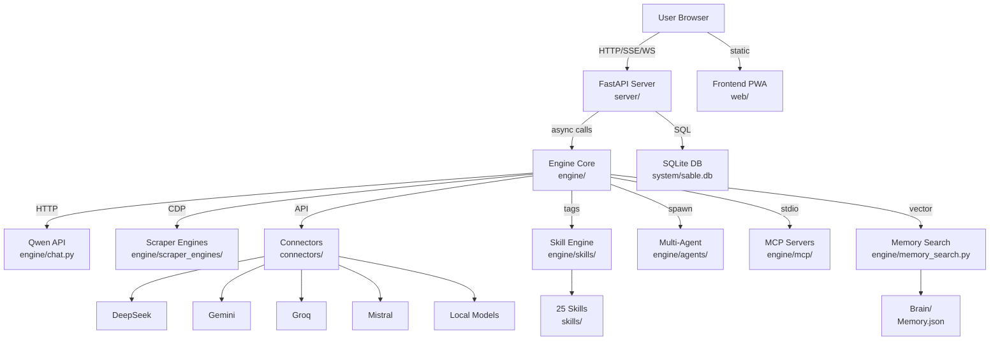

# Sable

Self-hosted agentic development companion combining AI chat, a full web IDE, browser automation, multi-agent orchestration, persistent memory, and a content library into one personal platform. Proxies Qwen and DeepSeek through browser session auth (no API keys required for Qwen), supports Gemini/Groq/Mistral via API keys, and runs entirely on your machine.

***

## Quick Start

```bash
git clone https://github.com/AminulIslamSifat/Sable.git && cd Sable
chmod +x init start status
./init    # install deps, Playwright, browser profiles, systemd service
./start   # launch via systemd (or direct uv fallback)
```

Open `http://127.0.0.1:61770` in your browser. First run opens a Chromium window for Qwen/DeepSeek login — tokens are stored locally in `system/.session_tokens.json`.

> [!IMPORTANT] Prerequisites
> - Python ≥ 3.12
> - [uv](https://docs.astral.sh/uv/) package manager
> - Go (optional, only needed to rebuild the DeepSeek PoW solver)
> - systemd (for persistent service; optional — `./start` falls back to direct `uv run`)

***

## Project Structure

Each major directory has its own `README.md` with detailed documentation:

| Directory | Purpose | Docs |
|:--|:--|:--|
| [`engine/`](engine/README.md) | Core logic: chat, scraping, skills, agents, memory, MCP, diary, security, research, cookbook | [→ Details](engine/README.md) |
| [`server/`](server/README.md) | FastAPI app, 20+ API routes, SQLite database, scheduler, auth | [→ Details](server/README.md) |
| [`connectors/`](connectors/README.md) | AI backend clients: DeepSeek, Gemini, Groq, Mistral, Local | [→ Details](connectors/README.md) |
| [`web/`](web/README.md) | Vanilla JS PWA frontend with Monaco IDE, terminal, agent UI | [→ Details](web/README.md) |
| [`skills/`](skills/README.md) | 25 self-contained skill modules with auto-discovery | [→ Details](skills/README.md) |
| [`Brain/`](Brain/README.md) | Persistent memory store: semantic, episodic, procedural, ephemeral, protected | [→ Details](Brain/README.md) |
| [`instruction/`](instruction/README.md) | System prompts: persona (Maria.md), formatting rules, personal context | [→ Details](instruction/README.md) |
| [`system/`](system/README.md) | Runtime data: SQLite DB, 115+ browser profiles, tokens, configs | [→ Details](system/README.md) |
| [`output/`](output/README.md) | Generated content: notes, research, agent results, assets, logs | [→ Details](output/README.md) |
| [`test/`](test/README.md) | Test suite: pytest tests, integration tests, demo scripts | [→ Details](test/README.md) |

### Root Files

| File | Purpose |
|:--|:--|
| `server.py` | Uvicorn entry point — imports FastAPI app, binds to host/port from engine/config.py |
| `init` | Setup script: `uv sync`, Playwright install, browser profile distribution, systemd service creation |
| `start` | Launch script: starts systemd service (or direct `uv run` fallback), auto-opens browser |
| `status` | Status checker: verifies port 61770 is listening, displays clickable link |
| `setup` | One-liner clone + venv bootstrap: `git clone && python3 -m venv && source .venv/bin/activate` |
| `pyproject.toml` | Project metadata, Python 3.12.13 pin, 30 dependencies |
| `.gitignore` | Excludes system/, output/, credentials, browser profiles, Memory.json, Maria.md |

***

## Architecture Overview



> [!EXAMPLE]
> User sends message → FastAPI route → Engine service → Backend (Qwen/DeepSeek/Gemini/etc.) → Stream back via SSE → Frontend renders with typewriter animation. Tool tags detected → Skill Engine dispatches → Results streamed back.

***

## Core Systems

### Chat & Streaming

SSE-based streaming with typewriter animation (adaptive: low-memory devices get larger batches). Supports thinking modes (Fast/Auto/Thinking) per model. Multi-tab chat with independent scroll positions. Context injection includes timestamp, cwd, and open file metadata.

- **Qwen backend**: Browser session auth via Playwright. WAF tokens (`bx-ua`, `bx-umidtoken`) sniffed from live Chromium requests. Auto-refresh on 401/403. Aliyun OSS image upload with STS token flow.
- **DeepSeek backend**: Pure HTTP connector. Auth token extracted from browser `localStorage`. Each request solves a PoW challenge via Go binary (`connectors/deepseek/pow_solver/`).
- **API connectors**: Gemini, Groq, Mistral — all with multi-key rotation and streaming.
- **Local models**: OpenAI-compatible endpoint for Ollama, llama.cpp, vLLM, etc.

### Multi-Account Browser Profiles

115+ browser profile directories under `system/` for multi-account management:

- `browser-data-acc0` through `browser-data-acc107` — individual sessions
- `browser-data` — symlink to active account (atomic switching)
- `browser-scraper-data` — dedicated scraper profile
- `automation-browser-data` — automation/testing profile
- Each has a `.bak` counterpart for backup/restore

Profile stripping removes cache/GPU data while preserving cookies, localStorage, and session state. Switch via UI, API, or `engine/browser_opener.py`.

### Scraper Engines (Browser Automation)

Two dedicated CDP-based browser engines for driving live chat interfaces:

| Engine | Size | Target |
|:--|:--|:--|
| `scraper_engines/qwen/qwen_engine.py` | 103KB | chat.qwen.ai |
| `scraper_engines/deepseek/deepseek_engine.py` | 50KB | chat.deepseek.com |

Capabilities: Chrome/Thorium/Playwright-Chromium launch, WebSocket proxy for CDP interception, DOM mutation observer response capture, clipboard fallback, instruction injection with SHA256 hash tracking, thought expansion automation, session markdown archival, CSS injection, headed/headless mode switching.

### Multi-Agent Orchestration

Hub-and-spoke architecture with wave-based parallel execution:

- **7 Roles**: analyst, coder, writer, sysutil, docs, visuals, tester
- **Concurrency**: Up to 5 simultaneous agents
- **Resilience**: Circuit breakers per backend, loop detection (consecutive + total call limits)
- **Todo tracking**: Live progress visualization with checkbox UI
- **Auto-turn**: Agent completions signal frontend to render results identically to user messages
- **Teacher escalation**: Difficult subtasks escalate to more capable models
- **Notifications**: Per-chat async queue drained at turn start
- **Output**: Agent results saved as markdown to `output/agent/`, browsable via Library

### Memory System

- **Storage**: `Brain/Memory.json` (categories: semantic, episodic, procedural, ephemeral) + `Brain/Protected.json`
- **Search**: fastembed vector search with configurable top-k, thresholds, max prompt chars (auto-disables on <8GB RAM)
- **Consolidation**: Post-conversation extraction of facts, auto-classification, deduplication, skill creation
- **Protected entries**: Credentials and security data immune to deletion
- **Human-readable**: JSON you can edit by hand — no opaque vector DB

### Skill Engine (25 Skills)

Self-contained skill directories with auto-discovery:

```
skills/<name>/
├── instruction.md    # Routing protocol + usage docs
├── skill.json        # Manifest: name, key, version, tags, priority, scope
└── scripts/          # Optional helper scripts
```

| Category | Skills |
|:--|:--|
| Code & System | code_editor, background_command, system_repair, testing_debugging, grep_search |
| Research & Web | online_search, deep_research, http_client, browser_control |
| Documents | document_skills (PDF, DOCX, PPTX, XLSX), text_humanizer |
| Visuals | graph_master, svg_creator, frontend_design, simulacra_engine |
| Communication | email, telegram |
| Study | study_suite |
| Media | youtube_downloader |
| Device | phone_control |
| Meta | multi_agent, ask_user, file_uploader, mcp, tracknote_manager |

### MCP Client Integration

Full Model Context Protocol client (`engine/mcp/manager.py`):

- Spawns MCP servers as subprocesses over stdio
- Tool discovery via `list_tools()`
- Auto-routing: `call_tool_auto()` finds which server owns a tool
- Event loop isolation (separate asyncio tasks avoid anyio cancel scope conflicts)
- Config persistence in `system/mcp_servers.json`

### Diary System

Gemini-powered reflective session synthesis (`engine/diary/`):

- **Summarizer**: Summarizes individual session logs via Gemini API
- **Synthesizer**: Merges per-session summaries into cohesive diary entries
- **Key rotation**: Multi-API-key rotation with persistent state tracking
- Uses `gemini-3.1-flash-lite` with configurable temperature

### Cookbook (Local Model Serving)

Model download, serving, and hardware detection (`engine/cookbook/`):

- Hardware detection (GPU, RAM, VRAM) for compatibility checks
- Model download with progress tracking
- Serve/stop controls with preset configurations
- Persistent state for downloads and served models

***

## Web IDE

Sable includes a complete browser-based development environment alongside the chat.

### Monaco Editor
Full VS Code editor with language detection (Python, JS, TS, HTML, CSS, JSON, YAML, Markdown, TOML, SQL, XML, SVG, shell), configurable font size, dirty state tracking, auto-save, and Ctrl+S shortcut.

### File Tree Explorer
Recursive directory browsing with 30+ file type icons, root picker, recent folders history, new file/folder creation, and path bar.

### Integrated Terminal
Real PTY via `os.forkpty()` with Fish shell, WebSocket bridge, SIGWINCH forwarding, xterm.js frontend, and resizable panel. Multiple views: Terminal, Output, Problems tabs.

### Design System
Glassmorphism aesthetic with 11 themes, backdrop-filter effects, responsive layout, and adaptive streaming for low-memory devices. All vendor libraries bundled locally (no CDN dependency).

***

## Dependencies

Python 3.12.13 with 30 packages managed by `uv`:

| Package | Purpose |
|:--|:--|
| fastapi, uvicorn | Web framework and ASGI server |
| httpx | Async HTTP client for API connectors |
| playwright | Browser automation for Qwen/DeepSeek sessions |
| fastembed, numpy | Vector embeddings for memory search |
| google-genai | Google Gemini API SDK |
| telethon | Telegram messaging client |
| mcp | Model Context Protocol client |
| kokoro-onnx, misaki, soundfile | TTS voice synthesis |
| python-docx, python-pptx, openpyxl, pypdf, pdf2image | Document processing |
| matplotlib | Graph and plot generation |
| beautifulsoup4, lxml | HTML parsing for web scraping |
| oss2 | Aliyun OSS file upload |
| tenacity | Retry logic for resilient API calls |
| websockets | WebSocket support for terminal |
| pillow | Image processing |
| defusedxml | Safe XML parsing |
| pytest | Testing framework |

***

## Configuration

All runtime configuration lives in `system/` (gitignored):

| File | Purpose |
|:--|:--|
| `settings.json` | Global app settings |
| `agent_config.json` | Agent roles, model routing, skill scoping |
| `mcp_servers.json` | MCP server definitions |
| `.session_tokens.json` | Qwen browser session tokens |
| `.deepseek_tokens.json` | DeepSeek auth tokens |
| `.gemini_api_keys.json` | Gemini API keys (multi-key) |
| `.custom_models.json` | User-defined model endpoints |
| `memory_search_settings.json` | Vector search tuning |
| `scraper_settings.json` | Scraper engine preferences |

***

## Development

### Running Tests
```bash
uv run pytest test/ -x              # all tests
uv run pytest test/test_editor_tools.py -v  # specific file
```

### Adding Skills
1. Create `skills/<name>/` with `skill.json` + `instruction.md`
2. Optionally add `scripts/` for helpers
3. Restart server or wait for cache invalidation

### Adding Connectors
1. Create `connectors/<provider>/client.py` implementing `ConnectorProtocol`
2. Register in `connectors/__init__.py`
3. Add model entries in `engine/config.py` with `api_backend`

***

## License

Personal project. Not licensed for redistribution.
